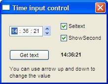



## Time input control

### Description

The control purpose is to emulate the MS Windows textbox time input control. It can show or hide the "seconds" box, set text selection true/false and it has change event as well. The control was made to fit in one of my projects but I'm sure you can easily change it to fit in yours too. Update #1 (21/Jan/2007): fixed leading zero issue. Update #2 (23/Jan/2007): fine code adjustments thanks to Roger G.
 
### More Info
 

             |
---                |---
**Submitted On**   |2007-01-23 19:00:02
**By**             |[Carlos\-Sz](https://github.com/Planet-Source-Code/PSCIndex/blob/master/ByAuthor/carlos-sz.md)
**Level**          |Beginner
**User Rating**    |4.8 (19 globes from 4 users)
**Compatibility**  |VB 6\.0
**Category**       |[Custom Controls/ Forms/  Menus](https://github.com/Planet-Source-Code/PSCIndex/blob/master/ByCategory/custom-controls-forms-menus__1-4.md)
**World**          |[Visual Basic](https://github.com/Planet-Source-Code/PSCIndex/blob/master/ByWorld/visual-basic.md)
**Archive File**   |[Time\_input2044341232007\.zip](https://github.com/Planet-Source-Code/carlos-sz-time-input-control__1-67678/archive/master.zip)

